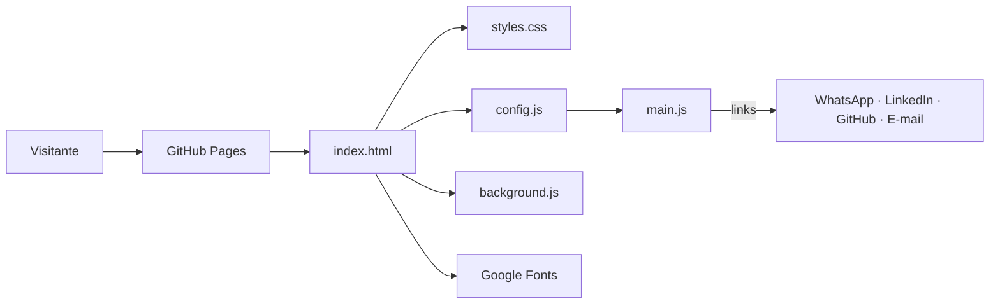

# Ésdras Andrade · Portfólio

Site pessoal de **Ésdras Andrade**, Senior Software Engineer: backend, APIs e arquitetura, aplicando IA com LLMs, RAG e agentes.

Página única, só com rolagem, responsiva do celular ao ultrawide. Feito com HTML, CSS e JavaScript puros, sem framework e sem etapa de build.

**Site:** https://esdrasandradecarapia.github.io/esdras-portfolio/  
**LinkedIn:** https://www.linkedin.com/in/esdrasandrade

---

## Seções

| Seção | Conteúdo |
|---|---|
| Topo | Nome, posicionamento, botões de contato, download do CV e demo de um agente de IA |
| Sobre | Resumo da trajetória |
| Experiência | Linha do tempo profissional (Infosys, Santillana, Runner) |
| Cases | Decisões técnicas: arquitetura, observabilidade, cache, dados, agentes de IA |
| Projetos | Plataforma logística Braskem, Legal Case Intelligence, Surf Forecast Agent |
| Stack | Tecnologias agrupadas por área |
| Formação | Graduações e idiomas |
| Contato | WhatsApp, LinkedIn, e-mail e GitHub |

## Estrutura

```
esdras-portfolio/
├── index.html                 # Estrutura e conteúdo da página
├── assets/
│   ├── css/
│   │   └── styles.css         # Estilos; cores e fontes em tokens no :root
│   ├── js/
│   │   ├── config.js          # Contatos e links (único arquivo a editar)
│   │   ├── main.js            # Monta os links a partir do config
│   │   └── background.js      # Fundo animado em <canvas>
│   ├── docs/
│   │   └── Curriculo_Esdras_Andrade.pdf
│   └── img/
│       ├── favicon.svg
│       ├── esdras.webp / .jpg  # Foto do topo (WebP com fallback JPG)
│       └── og-image.png       # Prévia de links (1200×630)
├── docs/
│   └── ARCHITECTURE.md        # Decisões técnicas do projeto
├── .github/workflows/
│   └── deploy.yml             # Deploy automático no GitHub Pages
├── .editorconfig
├── .gitignore
├── LICENSE
└── README.md
```

## Arquitetura



- **Conteúdo** vive no `index.html` (HTML semântico: `nav`, `header`, `section`, `article`).
- **Aparência** vive no `styles.css`, guiada por tokens (`--purple`, `--neon`, `--bg`…).
- **Dados de contato** vivem só no `config.js`. O `main.js` lê esse objeto e preenche os links, assim nenhuma URL fica repetida no HTML.
- **Efeito visual** isolado no `background.js`, que pode ser removido sem quebrar nada.

Os detalhes e o porquê de cada escolha estão em [`docs/ARCHITECTURE.md`](docs/ARCHITECTURE.md).

## Rodando localmente

Não precisa instalar nada.

```bash
git clone https://github.com/esdrasandradecarapia/esdras-portfolio.git
cd esdras-portfolio
```

Depois, uma das opções:

- **Mais simples:** abrir o `index.html` no navegador (duplo clique).
- **Com servidor local** (recomendado, simula o site publicado):
  ```bash
  python -m http.server 8000
  # ou: npx serve .
  ```
  e acessar http://localhost:8000

## Como editar

| Quero mudar… | Arquivo |
|---|---|
| Telefone, LinkedIn, GitHub, e-mail | `assets/js/config.js` |
| Textos, experiências, projetos | `index.html` |
| Cores e fontes | `assets/css/styles.css` (bloco `:root`) |
| Currículo | Substituir `assets/docs/Curriculo_Esdras_Andrade.pdf` mantendo o nome |

## Deploy

O deploy é automático: cada `push` na `main` publica o site no GitHub Pages pelo workflow `.github/workflows/deploy.yml`.

Configuração única no GitHub:

1. Abra o repositório → **Settings** → **Pages**.
2. Em **Build and deployment → Source**, escolha **GitHub Actions**.
3. Faça um push na `main` e acompanhe na aba **Actions**.

> Domínio próprio (ex.: `esdrasandrade.dev`): em **Settings → Pages → Custom domain**, informe o domínio e crie o registro DNS indicado pelo GitHub.

## Stack

- HTML5 semântico
- CSS3: Grid, Flexbox, custom properties, `clamp()`, container queries
- JavaScript puro (sem dependências)
- Google Fonts: Syne, Figtree e JetBrains Mono
- GitHub Actions + GitHub Pages

## Acessibilidade e responsividade

- Layout fluido com `clamp()` e container queries, sem rolagem horizontal
- Foco visível em todos os elementos interativos
- Animações desligadas com `prefers-reduced-motion`
- Ícones decorativos com `aria-hidden`; seções com rótulos

## Roadmap

- [x] Imagem de prévia (Open Graph) para links no LinkedIn e WhatsApp
- [x] Foto de perfil no topo
- [ ] Versão em inglês
- [ ] Domínio próprio

## Licença

Código sob [MIT](LICENSE). Textos, currículo e informações pessoais são de Ésdras Andrade.
